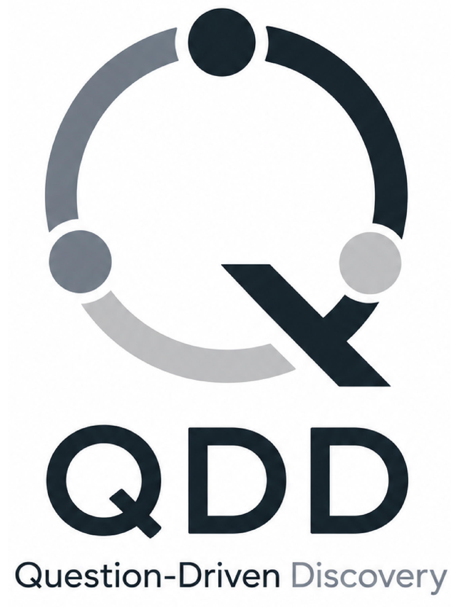

<div align="center">
  

  <p><strong>面向 AI 辅助生物医学发现的 Question-Driven Discovery 编排层。</strong></p>
  <p>把长期研究组织成可审计的问题、证据、artifact 和下一步决策循环。</p>

  <p><strong>语言</strong></p>
  <p><strong>简体中文</strong> · <a href="README.md">English</a></p>

  <p><strong>快速导航</strong></p>
  <p>
    <a href="#快速开始">快速开始</a>
    ·
    <a href="#六个人工工作流">人工工作流</a>
    ·
    <a href="#auto-模式">Auto 模式</a>
    ·
    <a href="#领域-skill-注入">领域 Skill</a>
  </p>
</div>

> **发布状态：** QDD `v0.1.0-rc.1` 是论文投稿对应的公开候选版本。
> 本仓库继续接受复现修复、bug 修复、文档改进和论文返修所需改动；新的研究架构
> 将在独立项目中开发，以保持论文版本稳定、可引用。

## 快速开始

要求：

- Node `>=20.19.0`
- Auto 模式需要配置 Anthropic-compatible 模型

本地安装：

```bash
npm install
npm run build
npm install -g .
```

初始化研究项目：

```bash
mkdir my-qdd-project
cd my-qdd-project
qdd init .
```

之后可以通过 Agent 运行六个人工工作流，也可以为核心研究循环启动 Auto 模式：

```bash
qdd auto --max-turns unlimited
```

更多安装细节见 [docs/04-installation-guide.md](docs/04-installation-guide.md)。

## QDD 能提供什么

<table>
  <tr>
    <td><strong>问题治理</strong><br />每个 study 都记录问题如何变化：refinement、confirmation、pivot 或 dissolution。</td>
    <td><strong>Agent 可读记忆</strong><br />contract、study、task、artifact 和 evolution 历史都保持人和 agent 可读。</td>
  </tr>
  <tr>
    <td><strong>领域 Skill 注入</strong><br />34 个本地 skill 按角色和任务路由，而不是一次性塞进所有 prompt。</td>
    <td><strong>公共数据证据化</strong><br />CELLxGENE、GEO、PubMed、CellMarker 和配受体 reference 都会成为可审计的本地 artifact。</td>
  </tr>
</table>

## 为什么需要 QDD

现在的 AI agent 已经能写代码、查数据库、跑分析。真正困难的是：当一个项目经历多个阶段、多个数据集、多个负结果和多个新信号时，如何保持研究方向不散、证据不丢、问题越来越可判断。

QDD 解决的是这个上层问题：

| 没有 QDD | 使用 QDD |
|---|---|
| 对话、脚本、notebook 和文件夹分散 | 人和 agent 共享同一套可读研究状态 |
| agent 只优化下一个任务 | agent 优化下一个更好的科学问题 |
| 负结果容易变成死胡同 | 负结果会被整理成 pivot、validation 或 robustness |
| 公共数据检索难以复盘 | 数据集和 reference 选择会被记录为可复用证据 |
| 每轮都要重新解释领域知识 | 领域 skill 会按角色和任务自动注入 |

## 六个人工工作流

QDD 的用户心智模型很简单：五个研究循环 workflow，加一个项目级 conclude workflow。Auto 模式只覆盖研究循环。

### 1. Start

建立项目契约：研究主题、边界、数据假设、运行环境、稳定资源和运行模式。这一层回答“我们为什么做这个项目”。

### 2. Propose

把当前研究前沿转成一个可执行的 study。一个好的 study 应该有可判断的问题、可证伪的预期、小规模 task graph，以及清晰的数据适配说明。

### 3. Explore

在执行前压力测试 study。这里适合和 agent 一起讨论边界、是否需要 public data、是否过宽或过窄、是否应该调整任务结构。

### 4. Apply

执行 study 里的任务。QDD 会注入 task-local 的领域 skill，在项目内运行代码，保留脚本和输出，并把最终产物整理到规范的 study output 中。

### 5. Close

综合证据并更新研究前沿。一个 close event 可以是 refinement、confirmation、pivot 或 dissolution。QDD 会记录问题如何变化、还剩什么边界、哪些 artifact 值得复用、下一步候选问题是什么。

### 6. Conclude

项目达到可综合状态后，在 Codex 中调用 `$qdd-conclude`，或在 Claude Code 中使用对应的 `qdd-conclude` 入口。通用 Agent 会先写跨 study 的 research synthesis，与用户对齐论文叙事，再完成并反复修订完整 `story.md`；只有用户接受 story 后才渲染 TeX。Conclude 仅用于 human mode，不是 Auto 模式阶段。

## Auto 模式

Auto 模式通过 Anthropic-compatible SDK 自动运行完整研究循环：

```text
Start -> Propose -> Apply -> Close -> Propose -> ...
```

它不是一次性 prompt，而是面向长程研究的自动编排。runtime 根据 QDD 项目状态决定下一阶段；thesis-manager 负责判断项目是继续、停止、验证、转向，还是寻找更合适的数据。

最小启动方式：

```bash
qdd auto --max-turns unlimited
```

目前 Auto 模式只支持 Anthropic 协议。运行前需要安装依赖并配置 Anthropic-compatible 模型。如果默认后端使用 DeepSeek，需要通过 Anthropic-compatible gateway 或内部代理接入：

```bash
export ANTHROPIC_AUTH_TOKEN="your-api-key"
export ANTHROPIC_BASE_URL="https://<your-anthropic-compatible-deepseek-gateway>"
export ANTHROPIC_MODEL="deepseek-reasoner"
qdd auto --max-turns unlimited
```

也可以显式指定模型：

```bash
qdd auto --model deepseek-reasoner --max-turns unlimited
```

## 领域 Skill 注入

QDD 当前内置 **34 个本地 skill**，并且按角色和任务路由，而不是一次性塞进所有 prompt。

| Skill 层级 | 当前覆盖 |
|---|---|
| Thesis planning | 项目前沿规划、继续/停止/pivot 决策 |
| Study brain | 单细胞、空间组学、public-data planning |
| scRNA-seq | QC、integration、clustering、annotation、DE、group stats、module score、enrichment、communication、trajectory |
| scATAC-seq | LSI preprocessing、latent integration、gene-activity annotation、DAR |
| Spatial transcriptomics | QC、integration、clustering、annotation、group stats、DE、neighborhood、niche composition、structure quantification |
| Public data / reference | CELLxGENE、GEO、PubMed、CellMarker、ligand-receptor resources |

关键不只是工具数量，而是 **按角色注入**：

- thesis-manager 只拿项目前沿规划 skill
- study-brain 只拿 study planning skill
- executor 只拿当前 task 真正需要的领域 skill
- public-data skill 和 downstream analysis skill 解耦

这样 prompt 更轻，分析更可复现，agent 行为也更容易审计。

## 公共数据作为一等研究上下文

QDD 把外部数据和 reference 当成证据，而不是藏在 prompt 里的记忆。

当前支持的 public-data/reference surface 包括：

- CELLxGENE dataset discovery
- GEO candidate capture
- PubMed evidence capture
- CellMarker marker reference capture
- ligand-receptor database capture

数据获取和下游分析是解耦的：

```text
external source -> fetch/capture skill -> local artifact -> domain executor -> study output
```

也就是说，agent 可以先查找或验证数据集，再把规范化后的本地 artifact 交给单细胞或空间组学 workflow，而不是把搜索逻辑混进分析代码里。

## QDD 不是什么

- 不是临床诊断系统。
- 不是黑盒云端 notebook。
- 不是替代领域专家判断。
- 不是每个分支都提前写死的传统 workflow engine。

QDD 是人和 agent 共同推进科研项目的协议层：本地文件、显式证据、可复用 artifact，以及持续演化的问题。
